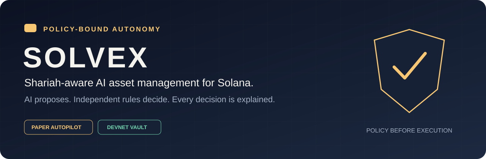
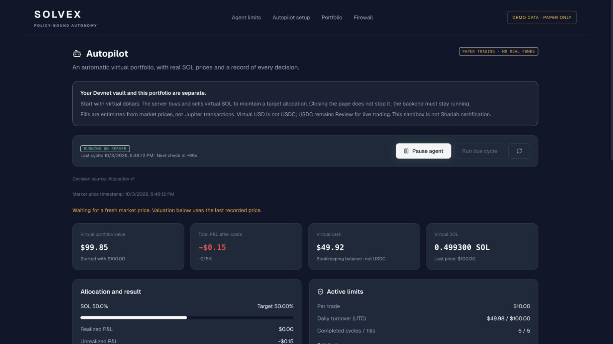

<p align="center">
  
</p>

# Solvex — Shariah-Aware AI Asset Manager

[](https://github.com/zhenups-alt/solvex/actions/workflows/ci.yml)
[](https://explorer.solana.com/address/8oi1inxaWoWmY7FjEEERuCdbGdCQpfgAg2KHyXFYAkP8?cluster=devnet)
[](docs/architecture.md)
[](docs/shariah-methodology.md)

> AI proposes portfolio actions. A deterministic Shariah Firewall and Risk Engine decide
> whether they are allowed — with user-defined limits and an explainable decision log.

[Run the MVP](#quick-start) · [3-minute demo guide](docs/demo.md) · [Documentation](docs/README.md) · [Devnet program](https://explorer.solana.com/address/8oi1inxaWoWmY7FjEEERuCdbGdCQpfgAg2KHyXFYAkP8?cluster=devnet)

**Current release: autonomous paper trading + a separate Devnet vault.** Mainnet trading
is not enabled. No wallet or vault balance funds the virtual portfolio. Solvex does not
promise returns or claim that every supported asset is universally halal.



*UI preview: actual application components in an isolated demo session. Displayed balances
use illustrative paper data, not live trading performance or a user's funds.*

## Hackathon Submission

Solvex demonstrates wallet ownership, user limits, autonomous virtual execution and
transparent policy/risk decisions in a Solana asset-management workflow.

- **Repository owner:** [@zhenups-alt](https://github.com/zhenups-alt).
- **Demo video:** in preparation; the recording link will be added when ready. Reviewers can
  use the quick start and [demo guide](docs/demo.md).
- **Public application and submission links:** not published yet.
- **Release boundary:** a development MVP, not an audited service accepting public deposits.

### Team

- **Bakhram Ilakhunov (Илахунов Бахрам)** — Full-Stack Developer & ML/AI Engineer.
- **Zhumagali Yerbol** — Full-Stack Developer & ML Engineer.

## Problem and Solution

### 1. A recommendation is not an execution policy

**Problem:** a persuasive AI response does not prove a trade is permitted.
**Solvex:** an untrusted proposal passes independent, deterministic asset, protocol,
transaction and risk checks.

### 2. Shariah screening needs explicit uncertainty

**Problem:** a blanket “halal” label hides disputed mechanisms and missing evidence.
**Solvex:** versioned `Eligible / Review / Blocked` classifications; disputed or unknown
cases cannot auto-execute. Qualified review remains a Mainnet prerequisite.

### 3. Automation needs user-controlled boundaries

**Problem:** the agent should not decide its own spending authority.
**Solvex:** saved capital, trade, turnover, slippage and drawdown limits, with pause/resume.
Devnet vault limits are separately enforced on-chain in token units.

### 4. Users need to understand what happened

**Problem:** an opaque buy/sell signal does not explain an action or rejection.
**Solvex:** a persistent journal of proposals, policy outcomes, risk checks and virtual fills,
alongside portfolio P&L after estimated costs.

## Why Solana

- **Wallet-native ownership:** Phantom message signatures identify users; vault control
  transactions require the owner's signature.
- **Program-derived custody:** per-owner PDAs and SPL token accounts provide the vault's
  on-chain enforcement boundary.
- **Composability:** Anchor and CPI support the intended constrained spot-swap integration.
- **On-chain markets:** Jupiter is the planned routing layer for screened Solana spot swaps,
  not a centralized exchange. End-to-end Mainnet validation remains outstanding.
- **A testable progression:** Devnet interactions and a separate virtual ledger let the team
  test ownership, limits and accounting before a public-money release.

## Summary of Features

- Phantom connection and one-use, wallet-signed sign-in challenges.
- User profiles with investment, per-trade, turnover, slippage and drawdown limits.
- Versioned Shariah screening with classifications and explanations.
- Gemini recommendations constrained by allocation rules and independent checks.
- Server-side paper Autopilot: start, pause, resume, scheduled cycles and persistent history.
- Virtual SOL/USD accounting: estimated costs, cost basis, P&L and allocation.
- Price-freshness checks, cooldowns, atomic ledger updates and duplicate-cycle protection.
- Owner-signed Devnet vault creation, SOL deposit/withdrawal, pause and limit updates.
- English-first interface with Russian translation.

Live Mainnet swaps, audited public custody, certified Shariah governance and a demonstrated
profitable strategy are **not** shipped production features. See the [roadmap](docs/roadmap.md).

## Tech Stack

- **On-chain:** Rust, Anchor 0.31.1, Solana, SPL Token.
- **Frontend:** React 19, Vite 6, TypeScript, Tailwind CSS, Zustand, Phantom, `@solana/web3.js`.
- **Backend:** Python 3.11+, FastAPI, Pydantic, SQLAlchemy, Alembic.
- **Persistence:** PostgreSQL; SQLite for local development and isolated tests.
- **AI and data:** Google Gen AI SDK / Gemini; CoinGecko SOL snapshots.
- **Execution target:** constrained Jupiter spot routing; live execution disabled.
- **Verification:** pytest, Ruff, TypeScript checks, Node vault-client tests, GitHub Actions.

## Architecture

```text
Wallet owner ──► Signed session ──► Saved limits + risk profile
                                          │
Market snapshot ──► Allocation rules / optional Gemini proposal
                                          │
                              Shariah Policy Engine
                                          │
                                     Risk Engine
                                          │
                      ┌───────────────────┴────────────────────┐
                      │                                        │
                Not permitted                              Permitted
                      │                                        │
              No virtual trade                          Paper accounting
                      │                                        │
                      └──────────► Decision Log ◄───────────────┘

Separate current path: owner ──► Devnet vault deposit / withdraw / pause
Future live path:      checks ──► simulation ──► constrained Jupiter / Solana
```

The paper worker cannot sign or send blockchain transactions. An execution flag cannot
turn it into a live trader. See [architecture and trust boundaries](docs/architecture.md).

## Quick Start

Prerequisites: **Node.js 22**, **Python 3.11+**, **Docker with Compose** for PostgreSQL.
Phantom is needed for wallet interaction; Rust/Anchor only for building the program.
The **Allocation rules** paper strategy does not require an API key.

From a fresh clone:

```bash
git clone https://github.com/zhenups-alt/solvex.git
cd solvex
npm ci
python3 -m venv .venv
.venv/bin/python -m pip install -e './backend[dev]'
cp .env.example .env.local
cp backend/.env.example backend/.env
docker compose up -d --wait postgres
.venv/bin/alembic -c backend/alembic.ini upgrade head
npm run dev
```

Open [the local app](http://localhost:3000/autopilot) and [API docs](http://localhost:8080/docs).
These are local addresses, not a hosted public demo. Existing installations should preserve
their environment files and databases; see the [development guide](docs/development.md).

1. Connect Phantom and open **Agent limits**.
2. Save your profile; the first protected action requests a sign-in message signature.
3. Open **Autopilot**, choose virtual capital within the saved cap and acknowledge paper mode.
4. Start the agent, inspect its journal, and pause whenever needed.

Keep the backend running for scheduled cycles. Set `GEMINI_API_KEY` only in the ignored
`backend/.env` to enable Gemini. A Jupiter key is not needed for virtual accounting.
See [Development](docs/development.md) for SQLite setup, secrets, migrations and vault builds.

### Run checks

```bash
npm run lint
npm run test:vault
npm run build
node scripts/check-docs.mjs
.venv/bin/ruff check backend
.venv/bin/pytest -q backend/tests
```

CI runs frontend and backend checks without API keys or blockchain signing. These checks
are not a smart-contract audit or evidence of profitable performance.

## Roadmap

- [x] Wallet connection and authenticated profile changes.
- [x] Versioned policy/risk checks and explainable decisions.
- [x] Devnet vault deployment and owner controls.
- [x] Autonomous paper portfolio with optional Gemini recommendations.
- [x] Cost-aware accounting, pause/resume and regression tests.
- [ ] Validated Jupiter routes, transaction simulation and Mainnet submission.
- [ ] Independent contract/security review and remediation.
- [ ] Qualified Shariah review and documented catalog governance.
- [ ] Production deployment, monitoring, rate limits and recovery.
- [ ] Longer strategy evaluation before any public-money pilot.

Full acceptance criteria: [docs/roadmap.md](docs/roadmap.md).

## Resources

- [Documentation index](docs/README.md)
- [Architecture and trust boundaries](docs/architecture.md)
- [Shariah screening methodology](docs/shariah-methodology.md)
- [Three-minute demo recording guide](docs/demo.md)
- [Development and troubleshooting](docs/development.md)
- [Vault program](chain/README.md) · [Devnet Explorer](https://explorer.solana.com/address/8oi1inxaWoWmY7FjEEERuCdbGdCQpfgAg2KHyXFYAkP8?cluster=devnet)
- [Contributing](CONTRIBUTING.md) · [Security notes](SECURITY.md)

Public application, presentation, video and submission URLs will be added when available.

## License

No project-wide license has been selected yet. This repository does not currently grant an
MIT license; third-party packages retain their respective licenses.
